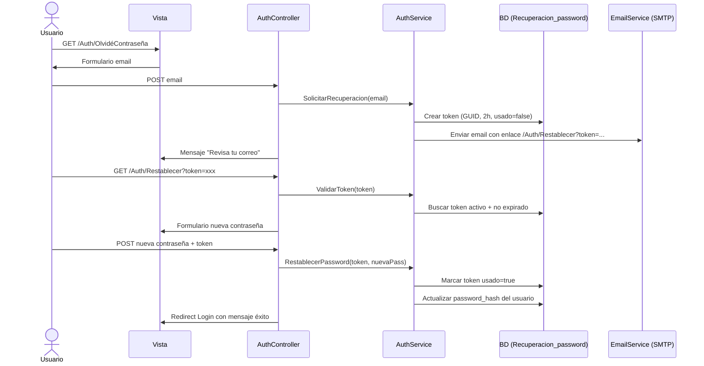

## Flujo general



---

## Archivos a crear / modificar

### 1. `Web.config` — Agregar configuración SMTP
```xml
<add key="SmtpHost"     value="smtp.gmail.com" />
<add key="SmtpPort"     value="587" />
<add key="SmtpUser"     value="tucorreo@gmail.com" />
<add key="SmtpPassword" value="tu_app_password" />
<add key="SmtpFrom"     value="EntrevistIA <tucorreo@gmail.com>" />
<add key="AppBaseUrl"   value="http://localhost:XXXX" />
```

---

### 2. `Entrevista/Services/EmailService.cs` — **NUEVO**
Servicio estático que usa `System.Net.Mail.SmtpClient` (ya incluido en .NET Framework, sin NuGet):
- `EnviarRecuperacion(string destinatario, string nombre, string enlace)` → envía el email HTML con el link

---

### 3. `Entrevista/ViewModels/RecuperacionViewModel.cs` — **NUEVO**
Dos ViewModels:
- `OlvideContrasenaViewModel` — solo campo `Email` con `[Required][EmailAddress]`
- `RestablecerContrasenaViewModel` — campos `Token` (hidden), `NuevaPassword`, `ConfirmarPassword` con `[Compare]`

---

### 4. `Entrevista/Services/AuthService.cs` — Agregar 2 métodos
- `SolicitarRecuperacion(string email)` → busca usuario activo, crea registro en `Recuperacion_password` (token GUID, expira en 2h, usado=false), llama a `EmailService`, retorna `bool`
- `ValidarTokenRecuperacion(string token)` → devuelve `Usuarios` si el token existe, `usado=false` y no está expirado
- `RestablecerPassword(string token, string nuevaPassword)` → hashea con BCrypt, actualiza `password_hash`, marca `usado_token_recuperacion=true`, retorna `bool`

---

### 5. `Entrevista/Controllers/AuthController.cs` — Agregar 4 acciones
| Método | Ruta | Descripción |
|--------|------|-------------|
| `GET`  | `/Auth/OlvideContrasena` | Muestra formulario de email |
| `POST` | `/Auth/OlvideContrasena` | Procesa email, envía correo |
| `GET`  | `/Auth/Restablecer?token=` | Valida token, muestra formulario nueva contraseña |
| `POST` | `/Auth/Restablecer` | Aplica la nueva contraseña |

- Todas con `[AllowAnonymous]`
- El GET de Restablecer redirige a Login si el token es inválido/expirado
- Mensaje genérico en POST OlvideContrasena (no revelar si el email existe)

---

### 6. `Entrevista/Views/Auth/OlvideContrasena.cshtml` — **NUEVA**
Vista con mismo layout que `Login.cshtml`:
- Icono 🔑, título "Recuperar contraseña"
- Campo email con icono `bi-envelope`
- Botón "Enviar instrucciones"
- Link "← Volver al login"
- Mensaje de éxito con `TempData["SuccessMessage"]` (panel verde)

---

### 7. `Entrevista/Views/Auth/Restablecer.cshtml` — **NUEVA**
Vista con mismo layout que `Login.cshtml`:
- Icono 🔐, título "Nueva contraseña"
- Campo oculto `Token`
- Campos `NuevaPassword` y `ConfirmarPassword` con toggle ojo
- Botón "Restablecer contraseña"
- Muestra error si token inválido con link al login

---

### 8. `Views/Auth/Login.cshtml` — Agregar link
Debajo del campo Password, añadir:
```html
<div style="text-align:right; margin-bottom:4px;">
    <a href="/Auth/OlvideContrasena" style="font-size:12px; color:var(--muted);">
        ¿Olvidaste tu contraseña?
    </a>
</div>
```

---

## Seguridad
- Token: `Guid.NewGuid().ToString()` — 128 bits de entropía
- Expiración: 2 horas
- Un solo uso: `usado_token_recuperacion = true` al activarlo
- Mensaje genérico en "Olvidé contraseña" para no revelar emails registrados
- `[ValidateAntiForgeryToken]` en todos los POST

---

## Verificación (DoD)
- [ ] Link "¿Olvidaste tu contraseña?" visible en Login
- [ ] Formulario de email muestra mensaje de confirmación tras enviar
- [ ] Email llega con enlace funcional (botón + link de respaldo)
- [ ] Token expirado o usado redirige a Login con mensaje de error
- [ ] Nueva contraseña se guarda correctamente y permite login inmediato
- [ ] Token queda marcado como `usado=true` en BD tras el restablecimiento
